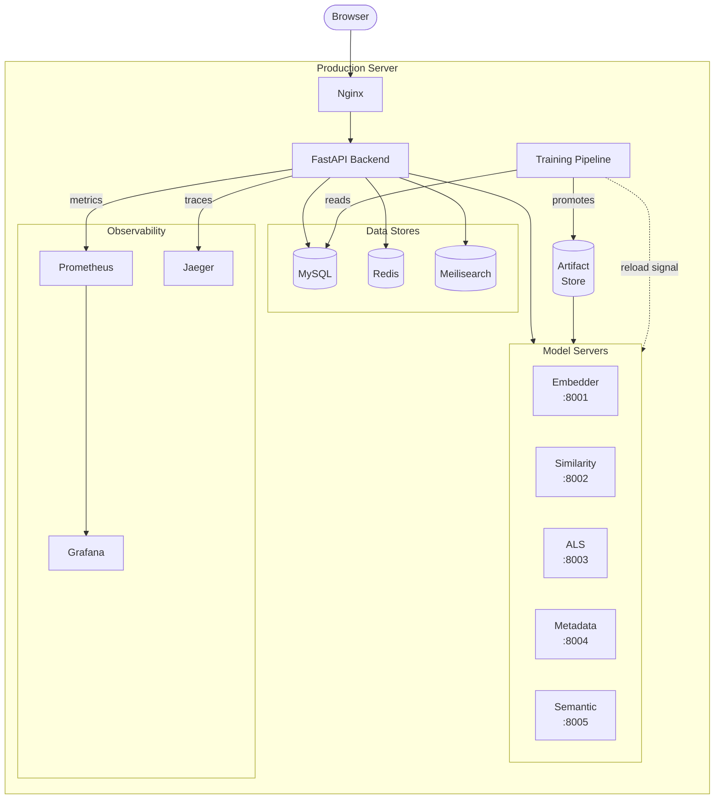
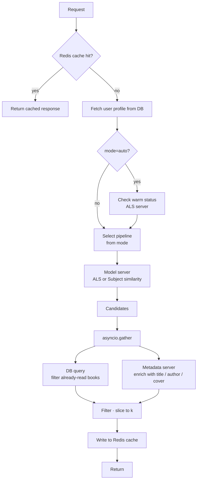
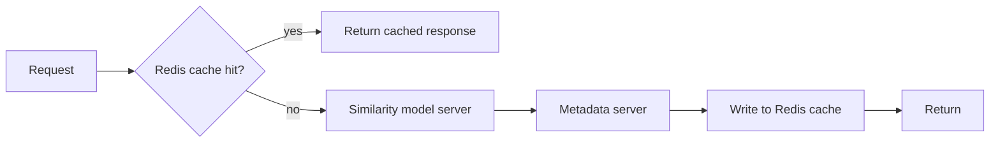
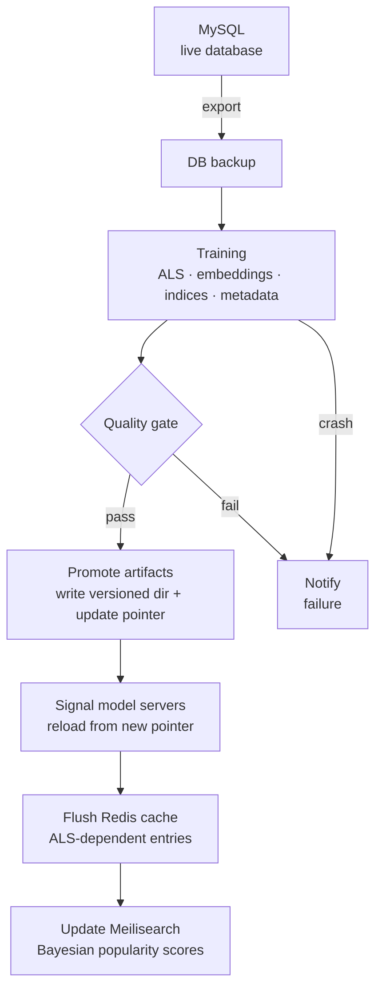
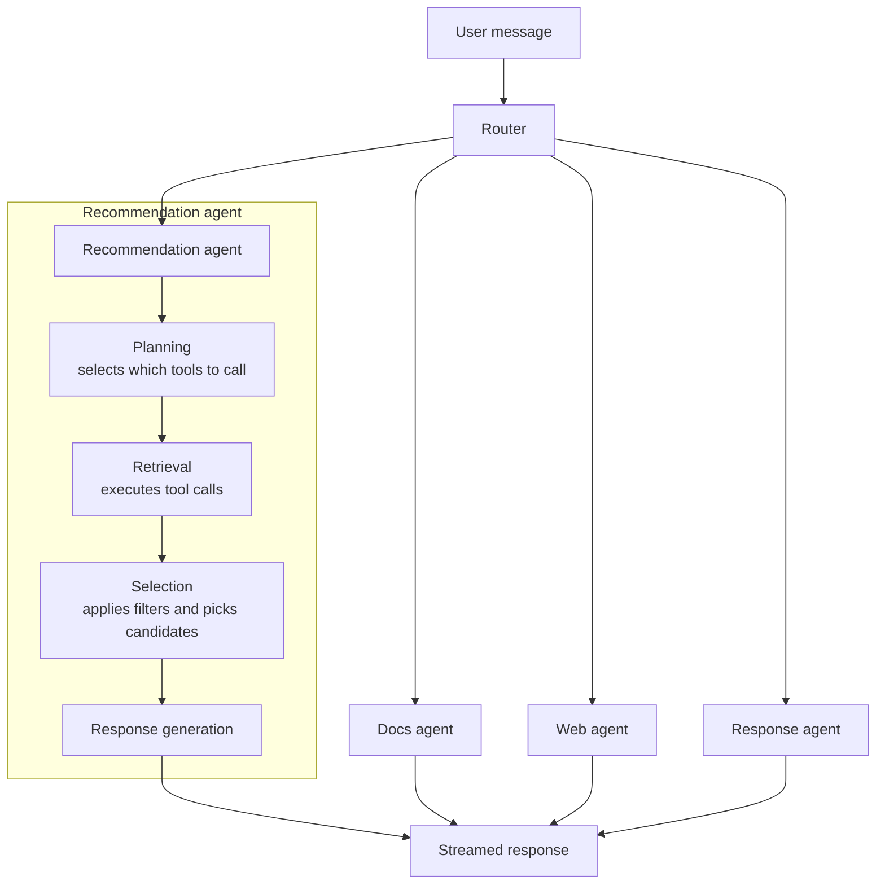

# Book Recommendation System


A full-stack, production-grade book recommendation platform with personalized recommendations, semantic and full-text search, item similarity, and an AI-powered chatbot. Built to explore the end-to-end challenges of deploying ML systems: data cleaning, model training, serving infrastructure, observability, and automation.

Live demo: [recsys.simonbouchard.space](https://recsys.simonbouchard.space)

---

## Architecture

The system is composed of several independent layers:

- **Frontend** — React + TypeScript SPA (search, recommendations, ratings, chatbot)
- **Backend** — FastAPI application handling auth, routing, caching, and business logic
- **Model servers** — 5 independent microservices, each owning a specific set of ML artifacts and endpoints
- **Support services** — MySQL (primary store), Redis (sessions, rate limiting, cache), Meilisearch (full-text search)
- **Enrichment pipeline** — a one-time LLM-driven pipeline that tagged ~170k books with curated subjects, tones, genre, and vibe strings via Kafka + Spark; these enriched tags power semantic search
- **Observability** — Prometheus metrics, Grafana dashboards, Jaeger distributed tracing via OpenTelemetry



Each model server runs in its own Docker container with read-only artifact mounts. Hot-reload is implemented via a shared version pointer file: the training pipeline writes a new version, signals the servers, and each server reloads its artifacts with zero downtime.

---

## Model Servers

| Server | Port | Responsibilities |
|---|---|---|
| Embedder | 8001 | Attention-pooled subject embeddings (PyTorch) |
| Similarity | 8002 | Subject HNSW index, ALS HNSW index, hybrid similarity |
| ALS | 8003 | ALS user/item factors, warm-user detection |
| Metadata | 8004 | Book metadata lookup, Bayesian popularity scores |
| Semantic | 8005 | FAISS vector index for semantic search |

---

## Recommendation Engine

The system supports two user states and three explicit modes:

**Warm users** (have prior ratings)
- ALS (Alternating Least Squares) collaborative filtering retrieves candidate books based on behavioral patterns.

**Cold users** (no ratings)
- Attention-pooled subject embeddings compute similarity between the user's preferred subjects and all books.
- A Bayesian popularity prior blends embedding similarity with global popularity (adjustable weight).

**Item similarity** offers three strategies:
- *Behavioral (ALS)*: strong signal for same author/series, sparse for niche books.
- *Subject*: noisier but better at surfacing hidden gems and underrepresented titles.
- *Hybrid*: weighted combination of both, adjustable at query time.

In `auto` mode the system detects whether the user has ALS factors and routes accordingly, falling back to subject-based or popularity-based recommendations when needed.

### Subject Embeddings

Each of the ~1,000 subjects in the vocabulary is represented by a learned embedding. These embeddings are trained with a **dual loss**:

- **Regression loss** — the model predicts a user's rating for a book from their subject preferences; this anchors embeddings to actual user taste signals.
- **Contrastive loss** — subjects that frequently co-occur on the same books are pulled together in embedding space; this captures semantic relationships between subjects without requiring explicit labels.

Both books and users are represented using **per-dimension attention pooling** over their subject embeddings. Rather than assigning a single scalar weight per subject, the attention mechanism produces a weight vector of the same dimensionality as the embeddings. This allows the model to learn that certain dimensions of an embedding are more or less relevant depending on the subject — the output has the same shape as a single subject embedding and can be compared directly via dot product.

For books, the subjects come from Open Library metadata. For users, subjects are selected directly by the user at signup; for the original Book-Crossing data, they were derived from each user's rating history.

---

## Inference Pipeline

Both pipelines are wrapped with a Redis cache check at the API layer. On a cache hit the full pipeline is skipped entirely. On a miss the pipeline runs and the final response is written to the cache before returning.

### Recommendations



The filter and enrichment steps run concurrently via `asyncio.gather` — both only need the candidate ID list, which is available immediately after the model server responds. This reduces the combined cost from ~18ms sequential to ~max(8ms, 10ms).

### Similarity



No DB round-trip — similarity is 2–3x faster than the recommendation path as a result.

---

## Performance

Measured on the production server (6 vCPU, older EPYC architecture) with Redis cache disabled, representing worst-case latency. Zero failures were recorded across all scenarios. The server scores ~565 ops/sec single-threaded and ~3150 ops/sec across 6 threads on a sysbench CPU benchmark, roughly comparable to a low-end cloud instance.

**Single-threaded latency (cache miss)**

| Path | Mean | Median | P95 |
|---|---|---|---|
| Warm / ALS | 44.9ms | 39.9ms | 87.4ms |
| Warm / Subject | 49.1ms | 41.3ms | 95.7ms |
| Cold / With subjects | 56.5ms | 44.6ms | 108.8ms |
| Cold / No subjects | 29.0ms | 26.2ms | 62.0ms |
| Similarity / Subject | 20.7ms | 19.8ms | 26.5ms |
| Similarity / ALS | 24.0ms | 20.7ms | 33.3ms |
| Similarity / Hybrid | 30.6ms | 26.7ms | 52.4ms |

**Sustained throughput — 10 concurrent workers, 30s**

| Path | Mean | P95 | RPS | Failures |
|---|---|---|---|---|
| Warm / ALS | 204ms | 403ms | 48.9 | 0 |
| Cold / With subjects | 256ms | 487ms | 38.8 | 0 |
| Similarity / Subject | 115ms | 241ms | 87.1 | 0 |
| Similarity / ALS | 119ms | 258ms | 83.9 | 0 |
| Similarity / Hybrid | 197ms | 375ms | 50.7 | 0 |

The concurrency overhead is expected given the deployment constraints. The production server runs the main app, all 5 model servers, and supporting services on 6 vCPUs — already oversubscribed at a single worker. FAISS threads per model server are capped at 6 to reduce single-threaded latency, which trades concurrency headroom for lower baseline latency. On a host that is oversubscribed regardless, this is the better tradeoff. Given the current traffic level, concurrent requests are rare in practice; the system was optimized for single-threaded latency specifically, with correct async and thread pool handling in place should concurrency increase.

---

## ML Training Pipeline

Training is automated and runs daily via a systemd timer directly on the production server. The pipeline:

1. **Data export** — training data is extracted from the live MySQL database into flat files
2. **DB backup** — current database is backed up before any training runs
3. **Training** — ALS factors, subject embeddings, similarity indices, metadata aggregates, Bayesian scores
4. **Quality gate** — evaluates recall@30 on the full training set and blocks promotion if it falls below a threshold
5. **Artifact promotion** — if the gate passes, the new version is written to a versioned directory and the active version pointer is updated
6. **Worker reload** — signals all 5 model servers to reload from the new pointer; each reloads independently with no downtime
7. **Cache flush** — ALS-dependent Redis cache entries are invalidated so stale recommendations are not served from the old model
8. **Meilisearch update** — Bayesian popularity scores are pushed to the Meilisearch index
9. **Notifications** — sends an email report on failure



Old artifact versions are retained for rollback and automatically retired after a configurable number of versions.

**A note on the quality gate:** the gate measures recall@30 on the full training set rather than a held-out split. This is a deliberate choice. A frozen random test set becomes unfair over time: as the data distribution shifts, the new model adapts to it and will appear to degrade on the frozen set even though it is actually better aligned with current users. A rolling test set of the most recent interactions avoids this but removes the most valuable training signal and produces an inconsistent baseline. Without sufficient traffic to rely on online metrics as the primary quality signal, training on the full dataset and evaluating on it is the least-bad option — the gate reliably catches catastrophic failures (corrupted data, broken scripts, hyperparameter disasters) which are the failure modes that actually occur in practice.

---

## Chatbot & Agents

The chatbot is built with LangGraph and routes requests across specialized agents:

- **Router** — classifies the intent of each message
- **Recommendation agent** — multi-stage pipeline: planning → retrieval → selection → response
- **Docs agent** — answers questions about the platform itself
- **Web agent** — handles general book/author questions via web search
- **Response agent** — handles messages that require no tool use (direct answers, greetings, clarifications)



The recommendation agent's retrieval step calls tools backed by the ML system directly — ALS-based recommendations, subject-based recommendations, and popularity-based results. Semantic search is also available as a retrieval tool, functioning as a more classic RAG-style lookup where the query is embedded and matched against the book vector index.

Users can opt in via a UI toggle to share their profile with the agent (favorite subjects and reading history). When enabled, the agent uses this context to personalize both the candidate retrieval and the generated prose.

Responses are streamed to the client via SSE. Conversation history is stored in Redis per session. Per-user rate limiting is also enforced via Redis, independently of history.

**Semantic search quality** was evaluated by comparing multiple embedding strategies — variants of the embedding string ranging from raw concatenated fields (title, author, description, Open Library subjects) to fully enriched strings (title, author, genre, LLM subjects, tones, vibe). An LLM judge with internet access evaluated the books retrieved by a set of representative queries across several use cases and examples per use case, assessing relevance without seeing the embeddings directly. Results clearly favored the enriched strategy, confirming that the LLM-curated metadata produced a stronger semantic signal than the raw fields.

**Agent evaluation** covers each agent with a set of use cases and multiple examples per use case. Criteria are scored 0/1 per example, with multiple judges on some criteria:

- **Planner** — evaluated by comparing structured JSON output directly against expected tool selections; no LLM judge needed since the output is deterministic
- **Retrieval** — verifies that it follows the plan, calls tools with correct arguments (e.g. formats semantic search queries correctly), retrieves the right number of results, can recover from failing tools, and adapts strategy when initial results are poor
- **Selection** — verifies correct output count, no duplicates, no more than two books from the same author, negative constraints filtered out, and results matching the query intent
- **Response agent** — evaluated by LLM judges across multiple criteria: the opening paragraph must implicitly reference the retrieval tools used and any personalization context, book descriptions must be specific to the query, and the closing paragraph must tie back to the reasons the books were selected

The recommendation agent is evaluated both per-stage and end-to-end, with the end-to-end evaluation applying all per-stage criteria together. The router, docs, web, and response agents follow the same evaluation structure — use cases with multiple scored examples — adapted to their respective responsibilities. Evaluations are run manually due to API cost.

---

## Book Enrichment Pipeline

Semantic search quality depends entirely on what gets embedded. Raw book metadata from Book-Crossing and Open Library is too inconsistent to embed directly — descriptions are sparse or missing for a large portion of the catalog, and raw subject strings are noisy.

A first enrichment pass (LLM subjects, tones, genre, vibe) improved retrieval significantly over the raw baseline, but introduced a new problem: the small model used (3–7B, due to budget constraints) hallucinated freely for obscure books with little available metadata, which make up roughly half the catalog. Asking it for less output uniformly would have discarded valid information for well-known books where the model had enough signal to work with — LLMs are not reliable at self-regulating output quantity before they start to confabulate.

The solution was to compute an **information availability score** per book from description length and number of Open Library subjects, then bucket books into quality tiers. Each tier has different output quantity ranges — richer books get more subjects, tones, and a longer vibe; sparse books get fewer or none. The model only produces what the available metadata can support, keeping hallucination contained without discarding good output for better-documented books.

This tiered approach improved retrieval quality over the first enrichment pass and substantially over the raw concatenated baseline.

---

## Observability

**Metrics** (Prometheus + Grafana)
- Request counters and latency histograms per path (recommendations, similarity, search, chat)
- Exposed at `/metrics`, scraped by Prometheus, visualized in Grafana
- **Drift monitoring** — proxy quality metrics tracked per mode on every request, with zero added latency (Prometheus histogram updates are lock-free atomic increments):
  - *Score distribution* — histogram of recommendation and similarity scores; median tracked over time to detect model output collapse
  - *Result count distribution* — histogram of result counts after read-book filtering; p10 drop signals a shrinking candidate pool
  - *Empty result rate* — counter incremented when a request returns zero results
  - Alert rules fire when any metric crosses a per-mode threshold calibrated to observed baselines (subject ~0.8, ALS ~0.3)
- **Click-through rate** — book clicks and impressions tracked per recommendation surface (`recommendations`, `similar`, `chatbot`) and mode; CTR visualized in Grafana to evaluate model usefulness from actual user behaviour

**Distributed tracing** (OpenTelemetry → Jaeger)
- Auto-instrumented for FastAPI, httpx (model server calls), and SQLAlchemy
- Manual spans added at service and pipeline boundaries
- Health and metrics endpoints excluded from trace noise
- Trace ID propagated through all model server calls for end-to-end request visibility
- Chatbot pipeline fully instrumented with manual spans: router classification, agent execution, four recsys pipeline stages (planning → retrieval → selection → curation), and per-tool spans for every LangGraph tool call; context propagated across the streaming response boundary to keep all spans correctly parented

---

## CI/CD

GitHub Actions runs on every push and pull request to `master`:

1. **Backend** — `ruff check` (lint), `ruff format --check`, `pytest tests/unit/`
2. **Frontend** — ESLint, TypeScript type check, Vite build
3. **Deploy** (master push only, after both pass) — SSH trigger runs `cd.sh` on the production server: `git pull` → `npm ci && npm run build` (frontend) → `systemctl restart` → health check loop

---

## Research & Experiments

Several architectures were explored before settling on the current design:

- Residual MLPs over dot-product predictions
- Two-tower and three-tower architectures
- Clustering and regression methods on user embeddings
- Gated-fusion mechanisms
- Alternative attention pooling strategies (scalar, per-dimension, transformer-based self-attention)

These experiments informed the tradeoffs between accuracy, latency, and serving complexity. The final stack favors simple serving (dot products and matrix lookups at inference time) with complexity pushed to training.

---

## Data & Processing

The Book-Crossing dataset is noisy and incomplete — inconsistent ISBNs, duplicate editions, missing metadata, and no subject information. Significant preprocessing was required before the data was usable for modeling.

**1. ID Normalization & Book Merging**
ISBNs were normalized and mapped to Open Library work IDs. Different editions of the same book were merged under a single `work_id`, reducing duplication and ensuring consistent interaction counts. Each book is assigned a stable integer `item_idx` for modeling.

**2. Subject Enrichment & Reduction**
Subjects were pulled from Open Library metadata. Raw extraction yielded ~130,000 unique subject strings; after cleaning, deduplication, and frequency filtering, this was reduced to ~1,000 meaningful subjects. A subject vocabulary (`subject_idx → subject`) is maintained for indexing.

**3. User Data Cleaning**
Ages: extreme or implausible values removed or bucketed. Locations: parsed into country and normalized. Favorite subjects: top-k subjects derived from each user's rated books and stored separately for cold-start embeddings.

**4. Rating Data Cleaning**
Out-of-range ratings discarded. Duplicates dropped. Users and books with too few interactions filtered out to stabilize training.

**5. Subject & Metadata Normalization**
Subjects stored as indexed lists with padding/truncation to fixed length. Generic categories (e.g., "Fiction", "General") excluded from `main_subject`. Authors, years, and page counts cleaned into canonical forms.

**6. Aggregate Features**
Book-level and user-level aggregates (rating count, mean, standard deviation) precomputed during export to ensure consistency across training and inference.

Result: a normalized schema with clean IDs, consistent metadata, and a manageable subject vocabulary that feeds both collaborative and content-based models.

---

## Tech Stack

**ML / Data**
- Implicit (ALS collaborative filtering)
- PyTorch (attention-pooled subject embeddings)
- FAISS + HNSW (similarity indices)
- Sentence-Transformers (semantic embeddings)
- Pandas, NumPy, SciPy

**Backend**
- FastAPI, Uvicorn, Gunicorn
- SQLAlchemy + aiomysql (async MySQL)
- Redis (sessions, rate limiting, cache)
- Meilisearch (full-text search)
- Kafka + Spark (enrichment pipeline, one-time use)
- LangChain, LangGraph, OpenAI SDK (chatbot agents)

**Frontend**
- React 19, TypeScript, Tailwind CSS 4, Vite
- Radix UI (headless components)

**Observability**
- OpenTelemetry (tracing instrumentation)
- Jaeger (trace storage and UI)
- Prometheus (metrics)
- Grafana (dashboards)

**Infrastructure**
- Docker, Docker Compose
- Nginx (reverse proxy)
- Systemd (service management)
- GitHub Actions (CI/CD)

**Code Quality**
- Ruff (lint + format)
- Pyright (type checking)
- Pytest + pytest-asyncio

---

## Local Setup

The model servers and supporting services are orchestrated with Docker Compose.

```bash
git clone https://github.com/simon-bouchard/book-recommendation-platform
cd book-recommendation-platform

# Copy and fill in environment variables
cp deploy/deploy.env.example deploy/deploy.env

# Start model servers and support services
docker compose -f docker/compose/docker-compose.yml up -d

# Set up Python environment
conda env create -f environment.yml
conda activate bookrec-api

# Run the backend
uvicorn main:app --reload
```

The frontend is built separately:

```bash
cd frontend
npm ci
npm run build
```

Grafana is available at `/grafana`, Jaeger at port `16686`, Prometheus at port `9090`.
